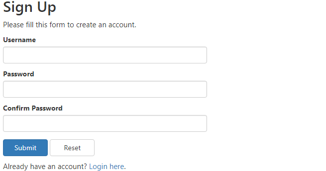

---
Languages:
  - SQl
  - PHP
  - BOOTSTRAP
Time: 25 minutes
Description: Simple Database Authentication Architecture.

---
# Auth-Database


### Create the Database Table First
```
CREATE TABLE users (
    id INT NOT NULL PRIMARY KEY AUTO_INCREMENT,
    username VARCHAR(50) NOT NULL UNIQUE,
    password VARCHAR(255) NOT NULL,
    created_at DATETIME DEFAULT CURRENT_TIMESTAMP
);
```
### Change Config.php Accordingly
